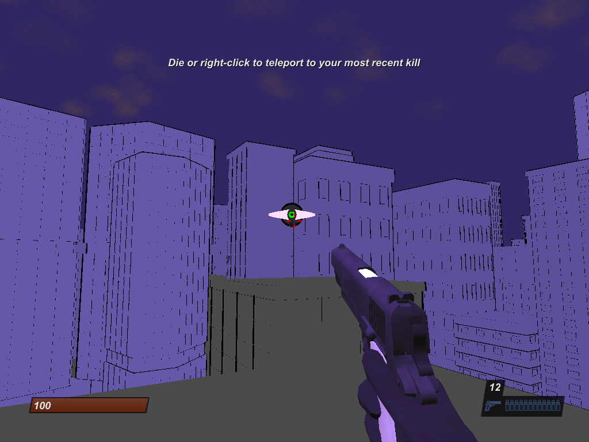
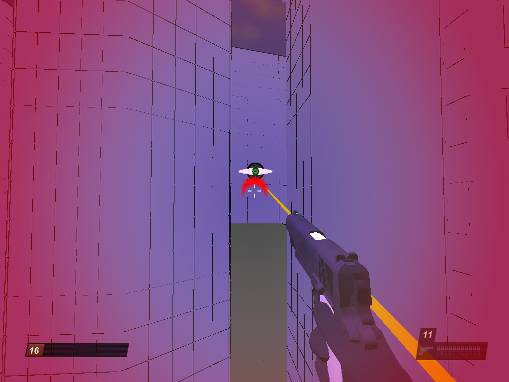
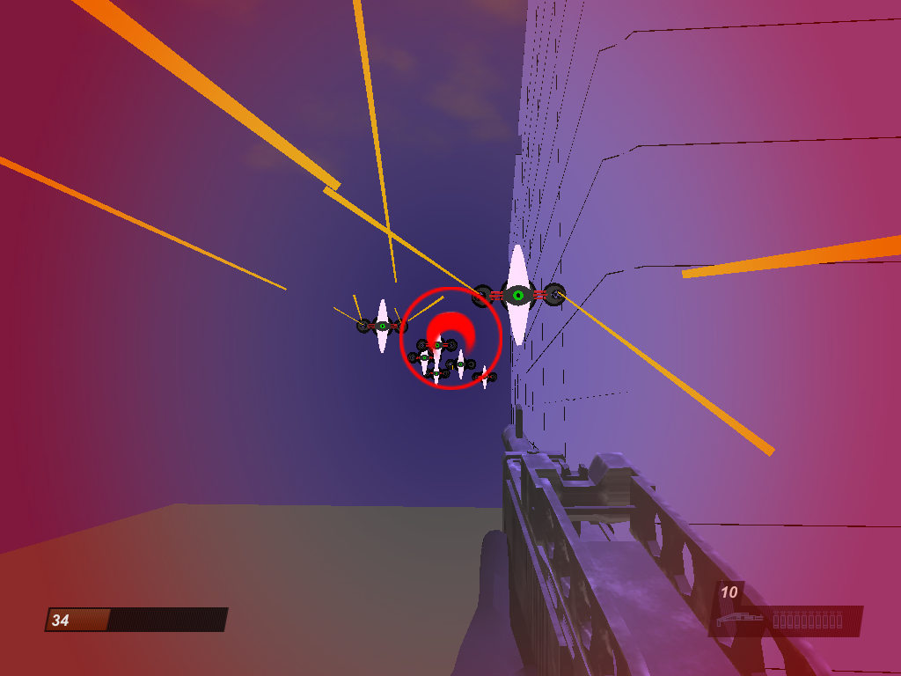

## Introduction

Our team is composed of Tyler Stokes, Nick Babcock, Ian Propper, Tommy Seidel,
and Mark Mevorah. We were tasked with creating an original game that would be
publicly showcased at the end of the semester.

## Initial Phase and Brainstorming

Our team of five formed soon after the final week of individual prototypes.  The
week before the final project was assigned we convened in a meeting to discuss
our  future game.  To get a head start, we decided to build off one of our
prototypes, as that would allow us to take advantage of work already completed.
One of our teammates, Ian Propper, by far had the most impressive prototype. He
was able to utilize a package created by Dastardly Banana Productions, LLC for
Unity called FPS Constructor, which provides the foundation for creating a first
person shooter game. From this foundation, he added the unique concept that upon
dying, the player is teleported to the location of their most recent victim.

All of us agreed that our game should be based on Ian's prototype. We came up
with ideas for improvement, such as an AI, a checkpoint system, and additional
levels for the player. Positions and responsibilities were soon assigned, but
later many jobs were merged in an attempt to facilitate progress in the few
weeks that were allotted for us to finish the project.

Our first deliverable was to brainstorm a title and logline for our game, and
we settled on the following:

> Deathmark: A fast-paced first-person-shooter and puzzler game. Players make a
> deal with a Shinigami, a death god, to become a shade; a soulless creature
> who, upon dying, teleports to the body of its most recent victim.

## Mixed Feelings

While having the third party package was initially a productivity boon, there
were growing pains. The entire package was written Unityscript. There is nothing
wrong with Unityscript by itself as a language, maybe outside of verbosity.
However, in the Unity editor, Unityscript is referred to as javascript, but this
is a severe misnomer. Unityscript is a classical inheritance language with other
Object Oriented features such as type annotations, whereas javascript is
prototypal. Newcomers, not knowing the difference would find seemingly
conflicting information on the internet. All members of the group came from a C#
background with past prototypes, and dealing with Unityscript was cumbersome at
best. If the languages that Unity accepted (C#, Unityscript, and Boo) could
better interoperate with each other, this may have not have been as large of an
issue. Unfortunately, there is only a very narrow and inefficient method to
achieve communication across languages, so we stuck with Unityscript. Briefly,
an idea was tendered of rewriting the foundation in C#, but this was decided
against because of time.

We decided to store our code in git hosted on a private Github repository. As
discovered in previous Unity projects, this doesn't come without difficulties,
as Unity extensively utilizes binary files, which are impossible to merge given
two different files. To reduce merge conflicts we adopted an impromptu naming
convention where we would store binary files under our individual names.
However, due to several members and their inexperience with git or situations
outside their control, issues with git arose. Thankfully, the team's git
expert, Nick Babcock, shouldered the burden of straightening out issues, and in
the end very little work or productivity was lost. Using source control,
overall was beneficial, but occasionally it was taxing on enthusiasm and time.

Github wasn't without its problem either. Tommy created a giant cityscape in the
3D modeling program Maya that ended up being over 100MB in size. He committed
the cityscape, but then realized that 100MB might be excessive and so he
promptly deleted the file and committed again. Then when he tried to sync to
Github the sync was denied because Github sensed a file over 100MB and Github
limits repository to 1GB in size with a max of 100MB for an individual file.
Thus, even though the 100MB file wasn't in the repository at the time, git saved
the file so that it could recover the file in the future if needed. Thankfully,
git provides a mechanism to rewrite history, so that it could appear as if the
large file was never in the repository in the first place.

Some of the design decisions we made had mixed reactions. For instance, the
notion of teleporting to the location of the last person you killed can be an
unnerving concept. We mitigated this by applying a toon shader to all objects,
which makes the game look cartoonish and more approachable. Another good example
is the aspect of ammo. There were multiple requests to remove the ammo, but we
kept it in game for a couple reasons. The first reason is that having a
mechanical gun without ammo would be foreign to most people. A laser would fix
this issue, but it was decided that would go against the feel of the game.
Another reason for ammo is that to remove it from the game wouldn't be worth the
effort, and so we kept ammo around. Ammo also presented a unique obstacle to
players as they had to plan their efforts in advance so they didn't have to
reload while chaining teleports in mid-air.

## Room for Improvement

The development of the AI didn't go as planned. Originally, there were turrets
that simply turned to follow the player and shot back when fired upon. We wanted
to replace the turrets and their AI mechanism with a Unity AI package called
RAIN. RAIN advertises their GUI based approach to creating a sophisticated AI;
however, there was a steep learning curve. Many of the tutorials and the videos
simply didn't work because RAIN had recently updated, and didn't retain
backwards compatibility. We had Mark work full time on creating a level that
used RAIN, while the rest of us focused on polishing the existing enemies. We
ended up replacing the box model of the original turrets with a much sleeker
version that Tommy constructed in Maya. Mark was able to implement a level using
several soldiers in RAIN that were able to patrol an area and attack the player
if the player encroached. Since Mark worked in near isolation on his level, when
trying to combine his level into the rest of the world, numerous problems arose
that prevented us from successfully incorporating it. Thus, the fruit of Mark's
labor can't be seen in the main game and can only be seen in `Assets/Plugins/FPS
Constructor V1/Scenes/Mark's Puzzle.unity`

If it hadn't of been prescribed and required for us, our group wouldn't have
utilized the burndown chart. It is, in our opinion, that a burndown chart
doesn't accurately represent the fluidity that is game development, especially a
game that is developed in a short amount of time by a small and close-knit team.
Any question of progress was better answered in the next group meeting than
through the burndown chart. Thus, the burndown chart was more of a indicator to
the instructor of our progress, and even then it was an extremely rough
estimate. Updating the burndown chart wasn't ever a priority of the group. A
couple hours before each class period, a team member had to remind everyone to
fill in their portion of the burndown chart. In the end, the chart was a chore
for our team.

Weaving a plot into our game was always an afterthought. The logline allowed
for a number of intricate narratives, but unfortunately, due to a lack of time
and skills these narratives were left by the wayside. If we knew how to create
cut scenes, we would have created the scene where the player meets the death
god and gains the ability along a pistol. Given the short period of time to
implement the game, we decided that focusing on gameplay would increase the
value of the game more than a cut scene.

By the end of development, the project turned into somewhat of a monstrosity.
Maya and Blender had to be installed so that objects could be rendered. To
view the data logged on the server, one had to dump the database into a
specific location so that Unity could read it. Not to mention, at one point in
the project a dependency on DirectX 9 was introduced, which we believe is
because of the shaders we were using. All of this complexity negatively
impacted build times and the ability of the team members to build the game.
Only a couple members could successfully build the game so that it could be
deployed. This took valuable time away from development. If we had known about
the complexity we would encounter, we may have better prepared for it.

## What Worked

Github issues. Not only did Github host our code, but also our asynchronous
communication. Anyone could create an 'issue', a discussion would ensue, and
after discussion was resolved the issue was closed. For instance, one of our
earliest issue was determine whether our game title should be one or two words.
In total a hundred issues were raised.

Collaboration workflow. Unlike previous projects, which were individual or
partner based, having five people all working on the same code proves
problematic logistically. It is paramount that everyone knows how the code is
changing and to make sure that no changes corrupt the code that would then
spread to the rest of the team. These problems were solved using what is known
as Github Forks and Pull Requests. By having each team member fork the master
repository, any syncing of a member's code would only effect their remote
repository and not the master. Then if the member wanted their changes
propagated main master branch, a pull request was sent to the master repository.
Another team member would then review the code and make a decision on it. This
way, every single line of code had at least two pair of eyes review it.

Data logging was surprisingly easy. Our team decided we wanted to log the user
id, the level, x, y, z coordinates, and whether their death was a deathmark
death. Since our game is played through a browser, it was trivial to host our
application on a server and then have Unity execute external code that would
relay the information to the database on the server. This data could then be
dumped into Unity's editor and then display the deaths as spheres, so that we
could visually identify where the majority of the deaths were occurring.

Playtesting was key in our development direction. We first playtested amongst
ourselves, as we covered a wide array of skills when it came to first person
shooter games, from Ian who has computer gaming equipment to Nick, who had never
played a first person shooter on the computer before. This worked for a while,
but we soon fell set in our ways, and it took a class playtest for us to really
recognize what players wanted with our game. Whenever we had a playtest in
class, we would pay attention to the user, see what their suggestions were, and
then create a Github issue, so that the team could discuss. Some of our core
functionalities came from these suggestions. For instance, allowing the player
to commit suicide by a button was immediately dismissed in our team, but
playtests revealed that players consistently utilized the feature when it was
implemented, so we decided to keep it.

The team was very effective at communication and each member was enthusiastic.
A team member could text the group that they were working on the project, and
within the hour, all of us would have convened to their location. While remote
work was theoretically possible, nothing beats close contact so that ideas can
be bounced around and problems solved on spot. This was especially true when
two people were editing the same binary file, as they had to communicate their
changes to each other.

## Conclusion

In conclusion, we are satisfied with the output of our game. We believe we
captured an original idea, teleporting to your latest victim upon death, and
created a prototype that displayed and stayed true to the idea. Our team
operated effectively and there wasn't a problem that we couldn't solve. We
believe that our prototype is viable for further development, and with enough
polish could become a successful indie title.
